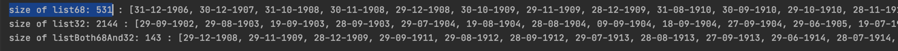

# Magic68

The next screenshot concerned me a little bit:

So, I've decided to create a Java-based project to check whether '68' is a specific number.

This code checked every day from `01-01-1900` to `01-01-2025` (125 years, ~45k days total)

After a quick iteration over the selected period, we can notice only `141` different possible sums: from minimal = 21 (for `01-01-1900`) to maximal = 161 (for `31-12-1999`)

If the distribution was uniform, we would get an average of 320+ repetitions for each number...

From this point of view, `68` is a pretty common value. (with the presence of 531 / 45 625, more than average)

 

On the diagram it will look like that:

- **sum = 68** - There are a lot of values (531) with sum = 68

`size of list68: 531 : [31-12-1906, 30-12-1907, 31-10-1908, 30-11-1908, 29-12-1908, 30-10-1909, 29-11-1909, 28-12-1909, 31-08-1910, 30-09-1910, 29-10-1910, 28-11-1910, 27-12-1910, 31-07-1911, 30-08-1911, 29-09-1911, 28-10-1911, 27-11-1911, 26-12-1911, 30-07-1912, 29-08-1912, 28-09-1912, 27-10-1912, 26-11-1912, 25-12-1912, 31-05-1913, 30-06-1913, 29-07-1913, 28-08-1913, 27-09-1913, 26-10-1913, 25-11-1913, 24-12-1913, 30-05-1914, 29-06-1914, 28-07-1914, 27-08-1914, 26-09-1914, 25-10-1914, 24-11-1914, 23-12-1914, 31-03-1915, 30-04-1915, 29-05-1915, 28-06-1915, 27-07-1915, 26-08-1915, 25-09-1915, 24-10-1915, 23-11-1915, 22-12-1915, 30-03-1916, 29-04-1916, 28-05-1916, 27-06-1916, 26-07-1916, 25-08-1916, 24-09-1916, 23-10-1916, 22-11-1916, 21-12-1916, 31-01-1917, 29-03-1917, 28-04-1917, 27-05-1917, 26-06-1917, 25-07-1917, 24-08-1917, 23-09-1917, 22-10-1917, 21-11-1917, 20-12-1917, 30-01-1918, 28-03-1918, 27-04-1918, 26-05-1918, 25-06-1918, 24-07-1918, 23-08-1918, 22-09-1918, 21-10-1918, 20-11-1918, 19-12-1918, 29-01-1919, 28-02-1919, 27-03-1919, 26-04-1919, 25-05-1919, 24-06-1919, 23-07-1919, 22-08-1919, 21-09-1919, 20-10-1919, 19-11-1919, 18-12-1919, 28-01-1920, 27-02-1920, 26-03-1920, 25-04-1920, 24-05-1920, 23-06-1920, 22-07-1920, 21-08-1920, 20-09-1920, 19-10-1920, 18-11-1920, 17-12-1920, 27-01-1921, 26-02-1921, 25-03-1921, 24-04-1921, 23-05-1921, 22-06-1921, 21-07-1921, 20-08-1921, 19-09-1921, 18-10-1921, 17-11-1921, 16-12-1921, 26-01-1922, 25-02-1922, 24-03-1922, 23-04-1922, 22-05-1922, 21-06-1922, 20-07-1922, 19-08-1922, 18-09-1922, 17-10-1922, 16-11-1922, 15-12-1922, 25-01-1923, 24-02-1923, 23-03-1923, 22-04-1923, 21-05-1923, 20-06-1923, 19-07-1923, 18-08-1923, 17-09-1923, 16-10-1923, 15-11-1923, 14-12-1923, 24-01-1924, 23-02-1924, 22-03-1924, 21-04-1924, 20-05-1924, 19-06-1924, 18-07-1924, 17-08-1924, 16-09-1924, 15-10-1924, 14-11-1924, 13-12-1924, 23-01-1925, 22-02-1925, 21-03-1925, 20-04-1925, 19-05-1925, 18-06-1925, 17-07-1925, 16-08-1925, 15-09-1925, 14-10-1925, 13-11-1925, 12-12-1925, 22-01-1926, 21-02-1926, 20-03-1926, 19-04-1926, 18-05-1926, 17-06-1926, 16-07-1926, 15-08-1926, 14-09-1926, 13-10-1926, 12-11-1926, 11-12-1926, 21-01-1927, 20-02-1927, 19-03-1927, 18-04-1927, 17-05-1927, 16-06-1927, 15-07-1927, 14-08-1927, 13-09-1927, 12-10-1927, 11-11-1927, 10-12-1927, 20-01-1928, 19-02-1928, 18-03-1928, 17-04-1928, 16-05-1928, 15-06-1928, 14-07-1928, 13-08-1928, 12-09-1928, 11-10-1928, 10-11-1928, 09-12-1928, 19-01-1929, 18-02-1929, 17-03-1929, 16-04-1929, 15-05-1929, 14-06-1929, 13-07-1929, 12-08-1929, 11-09-1929, 10-10-1929, 09-11-1929, 08-12-1929, 18-01-1930, 17-02-1930, 16-03-1930, 15-04-1930, 14-05-1930, 13-06-1930, 12-07-1930, 11-08-1930, 10-09-1930, 09-10-1930, 08-11-1930, 07-12-1930, 17-01-1931, 16-02-1931, 15-03-1931, 14-04-1931, 13-05-1931, 12-06-1931, 11-07-1931, 10-08-1931, 09-09-1931, 08-10-1931, 07-11-1931, 06-12-1931, 16-01-1932, 15-02-1932, 14-03-1932, 13-04-1932, 12-05-1932, 11-06-1932, 10-07-1932, 09-08-1932, 08-09-1932, 07-10-1932, 06-11-1932, 05-12-1932, 15-01-1933, 14-02-1933, 13-03-1933, 12-04-1933, 11-05-1933, 10-06-1933, 09-07-1933, 08-08-1933, 07-09-1933, 06-10-1933, 05-11-1933, 04-12-1933, 14-01-1934, 13-02-1934, 12-03-1934, 11-04-1934, 10-05-1934, 09-06-1934, 08-07-1934, 07-08-1934, 06-09-1934, 05-10-1934, 04-11-1934, 03-12-1934, 13-01-1935, 12-02-1935, 11-03-1935, 10-04-1935, 09-05-1935, 08-06-1935, 07-07-1935, 06-08-1935, 05-09-1935, 04-10-1935, 03-11-1935, 02-12-1935, 12-01-1936, 11-02-1936, 10-03-1936, 09-04-1936, 08-05-1936, 07-06-1936, 06-07-1936, 05-08-1936, 04-09-1936, 03-10-1936, 02-11-1936, 01-12-1936, 11-01-1937, 10-02-1937, 09-03-1937, 08-04-1937, 07-05-1937, 06-06-1937, 05-07-1937, 04-08-1937, 03-09-1937, 02-10-1937, 01-11-1937, 10-01-1938, 09-02-1938, 08-03-1938, 07-04-1938, 06-05-1938, 05-06-1938, 04-07-1938, 03-08-1938, 02-09-1938, 01-10-1938, 09-01-1939, 08-02-1939, 07-03-1939, 06-04-1939, 05-05-1939, 04-06-1939, 03-07-1939, 02-08-1939, 01-09-1939, 08-01-1940, 07-02-1940, 06-03-1940, 05-04-1940, 04-05-1940, 03-06-1940, 02-07-1940, 01-08-1940, 07-01-1941, 06-02-1941, 05-03-1941, 04-04-1941, 03-05-1941, 02-06-1941, 01-07-1941, 06-01-1942, 05-02-1942, 04-03-1942, 03-04-1942, 02-05-1942, 01-06-1942, 05-01-1943, 04-02-1943, 03-03-1943, 02-04-1943, 01-05-1943, 04-01-1944, 03-02-1944, 02-03-1944, 01-04-1944, 03-01-1945, 02-02-1945, 01-03-1945, 02-01-1946, 01-02-1946, 01-01-1947, 31-12-2005, 30-12-2006, 31-10-2007, 30-11-2007, 29-12-2007, 30-10-2008, 29-11-2008, 28-12-2008, 31-08-2009, 30-09-2009, 29-10-2009, 28-11-2009, 27-12-2009, 31-07-2010, 30-08-2010, 29-09-2010, 28-10-2010, 27-11-2010, 26-12-2010, 30-07-2011, 29-08-2011, 28-09-2011, 27-10-2011, 26-11-2011, 25-12-2011, 31-05-2012, 30-06-2012, 29-07-2012, 28-08-2012, 27-09-2012, 26-10-2012, 25-11-2012, 24-12-2012, 30-05-2013, 29-06-2013, 28-07-2013, 27-08-2013, 26-09-2013, 25-10-2013, 24-11-2013, 23-12-2013, 31-03-2014, 30-04-2014, 29-05-2014, 28-06-2014, 27-07-2014, 26-08-2014, 25-09-2014, 24-10-2014, 23-11-2014, 22-12-2014, 30-03-2015, 29-04-2015, 28-05-2015, 27-06-2015, 26-07-2015, 25-08-2015, 24-09-2015, 23-10-2015, 22-11-2015, 21-12-2015, 31-01-2016, 29-03-2016, 28-04-2016, 27-05-2016, 26-06-2016, 25-07-2016, 24-08-2016, 23-09-2016, 22-10-2016, 21-11-2016, 20-12-2016, 30-01-2017, 28-03-2017, 27-04-2017, 26-05-2017, 25-06-2017, 24-07-2017, 23-08-2017, 22-09-2017, 21-10-2017, 20-11-2017, 19-12-2017, 29-01-2018, 28-02-2018, 27-03-2018, 26-04-2018, 25-05-2018, 24-06-2018, 23-07-2018, 22-08-2018, 21-09-2018, 20-10-2018, 19-11-2018, 18-12-2018, 28-01-2019, 27-02-2019, 26-03-2019, 25-04-2019, 24-05-2019, 23-06-2019, 22-07-2019, 21-08-2019, 20-09-2019, 19-10-2019, 18-11-2019, 17-12-2019, 27-01-2020, 26-02-2020, 25-03-2020, 24-04-2020, 23-05-2020, 22-06-2020, 21-07-2020, 20-08-2020, 19-09-2020, 18-10-2020, 17-11-2020, 16-12-2020, 26-01-2021, 25-02-2021, 24-03-2021, 23-04-2021, 22-05-2021, 21-06-2021, 20-07-2021, 19-08-2021, 18-09-2021, 17-10-2021, 16-11-2021, 15-12-2021, 25-01-2022, 24-02-2022, 23-03-2022, 22-04-2022, 21-05-2022, 20-06-2022, 19-07-2022, 18-08-2022, 17-09-2022, 16-10-2022, 15-11-2022, 14-12-2022, 24-01-2023, 23-02-2023, 22-03-2023, 21-04-2023, 20-05-2023, 19-06-2023, 18-07-2023, 17-08-2023, 16-09-2023, 15-10-2023, 14-11-2023, 13-12-2023, 23-01-2024, 22-02-2024, 21-03-2024, 20-04-2024, 19-05-2024, 18-06-2024, 17-07-2024, 16-08-2024, 15-09-2024, 14-10-2024, 13-11-2024]`

- 2144 values with sum = 32 (pattern №2: adding numbers one-by-one)

- and 143 values matching both patterns.

`size of listBoth86And32: 143 : [29-12-1908, 29-11-1909, 28-12-1909, 29-09-1911, 29-08-1912, 28-09-1912, 29-07-1913, 28-08-1913, 27-09-1913, 29-06-1914, 28-07-1914, 27-08-1914, 26-09-1914, 29-05-1915, 28-06-1915, 27-07-1915, 26-08-1915, 25-09-1915, 29-04-1916, 28-05-1916, 27-06-1916, 26-07-1916, 25-08-1916, 24-09-1916, 29-03-1917, 28-04-1917, 27-05-1917, 26-06-1917, 25-07-1917, 24-08-1917, 23-09-1917, 28-03-1918, 27-04-1918, 26-05-1918, 25-06-1918, 24-07-1918, 23-08-1918, 22-09-1918, 19-12-1918, 29-01-1919, 28-02-1919, 27-03-1919, 26-04-1919, 25-05-1919, 24-06-1919, 23-07-1919, 22-08-1919, 21-09-1919, 19-11-1919, 18-12-1919, 19-09-1921, 19-08-1922, 18-09-1922, 19-07-1923, 18-08-1923, 17-09-1923, 19-06-1924, 18-07-1924, 17-08-1924, 16-09-1924, 19-05-1925, 18-06-1925, 17-07-1925, 16-08-1925, 15-09-1925, 19-04-1926, 18-05-1926, 17-06-1926, 16-07-1926, 15-08-1926, 14-09-1926, 19-03-1927, 18-04-1927, 17-05-1927, 16-06-1927, 15-07-1927, 14-08-1927, 13-09-1927, 19-02-1928, 18-03-1928, 17-04-1928, 16-05-1928, 15-06-1928, 14-07-1928, 13-08-1928, 12-09-1928, 09-12-1928, 19-01-1929, 18-02-1929, 17-03-1929, 16-04-1929, 15-05-1929, 14-06-1929, 13-07-1929, 12-08-1929, 11-09-1929, 09-11-1929, 08-12-1929, 09-09-1931, 09-08-1932, 08-09-1932, 09-07-1933, 08-08-1933, 07-09-1933, 09-06-1934, 08-07-1934, 07-08-1934, 06-09-1934, 09-05-1935, 08-06-1935, 07-07-1935, 06-08-1935, 05-09-1935, 09-04-1936, 08-05-1936, 07-06-1936, 06-07-1936, 05-08-1936, 04-09-1936, 09-03-1937, 08-04-1937, 07-05-1937, 06-06-1937, 05-07-1937, 04-08-1937, 03-09-1937, 09-02-1938, 08-03-1938, 07-04-1938, 06-05-1938, 05-06-1938, 04-07-1938, 03-08-1938, 02-09-1938, 09-01-1939, 08-02-1939, 07-03-1939, 06-04-1939, 05-05-1939, 04-06-1939, 03-07-1939, 02-08-1939, 01-09-1939]`

**Conclusion:** nothing special, pretty common number. Just an interesting coincidence.

Fell free to play with the source code, probably you will succeed in finding some magic there ;)

P.S. More details in the [doc](https://docs.google.com/spreadsheets/d/1VlMTlyAwFXMH-Vu3iH0scMY7ljYpeqplMVwRnLfPtT4/edit?usp=sharing)